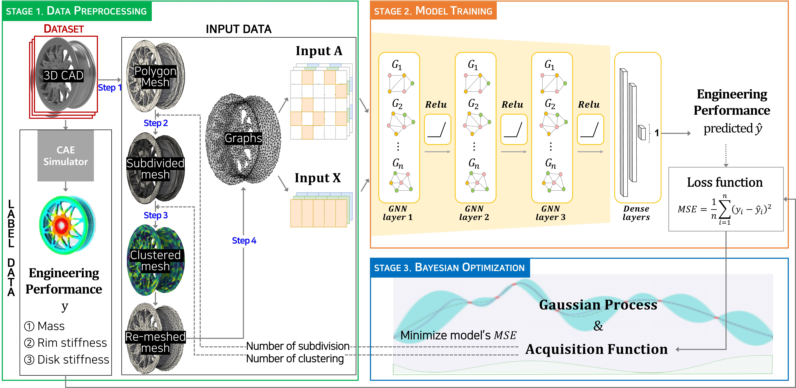

# BMO-GNN: Bayesian Mesh Optimization for Graph Neural Networks to Enhance Engineering Performance Prediction

This repository contains the research code for the paper:

> **BMO-GNN: Bayesian Mesh Optimization for Graph Neural Networks to Enhance Engineering Performance Prediction**  
> Jangseop Park and Namwoo Kang.

**Abstract:**  
High-fidelity engineering simulations (e.g., FEA or FEM) are crucial in 3D CAD-based design but often require significant computational resources, making them challenging for design optimization or real-time prediction. This paper presents **BMO-GNN**, a graph neural network (GNN) surrogate model combined with **Bayesian optimization (BO)** to dynamically determine mesh resolution. By converting CAD models into **polygon meshes** and then into **graphs**, our model learns to predict engineering properties (e.g., mass, rim stiffness, disk stiffness). Through BO, the model adaptively searches for optimal parameters (subdivision and clustering) that maximize accuracy while minimizing training costs. BMO-GNN significantly outperforms naive MCMC in terms of both efficiency and predictive performance, achieving up to R² 0.98.



---

## Project Structure

An example directory structure is shown below. Adjust to match your setup:

<pre>
.
├── data
│   ├── graphs.pkl
│   ├── stl
│   │   ├── wheel_0001.stl
│   │   ├── wheel_0002.stl
│   │   └── ...
│   └── ...
├── figures
│   ├── graphical_abstract.jpg
│   └── ...
├── run_model.py           # Main script (Bayesian optimization + GNN training)
├── preprocess.py          # Data preprocessing (subdivide, cluster, etc.)
├── config.py              # Configuration loader
├── models.py              # GNN architectures (Spektral-based)
├── utils.py               # Utility functions (training loops, logging, etc.)
├── plot_utils.py          # Visualization, Grad-CAM, animations, etc.
├── requirements.txt
└── README.md              # This document
</pre>

## Data Download Note

- **Necessary Files**  
  - `data/graphs.pkl` or equivalent graph/mesh data  
  - Label files with mass, rim stiffness, disk stiffness, etc.  
  - Original STL or OBJ 3D CAD files (optional)  

Provide a [Kaggle or Drive link](#) if the dataset is publicly available.

## Getting Started

### 1. Clone the Repository

```bash
git clone https://github.com/username/BMO-GNN.git
cd BMO-GNN
```
### 2. Install Dependencies

```bash
pip install -r requirements.txt
```
Make sure you have libraries like spektral, pyvista, pyacvd, bayes_opt, tensorflow, numpy, scipy, sklearn, etc., in requirements.txt.

### 3. Data Preprocessing
#### 3.1. Mesh → Graph Conversion
- Script: `preprocess.py`
- Starting from STL or VTK meshes, we do:
  - Subdivision (num_subdivide)
  - Clustering (num_cluster)
  - Convert to graph (nodes, edges, adjacency matrix)

**Example:**
```bash
python preprocess.py \
    --num_subdivide 3 \
    --num_cluster 4000 \
    --some_option ...
```
(Depending on your code structure, this step may be integrated into `run_model.py`.)

#### 3.2. Scaling & Split Dataset
The functions `minmax_scaler` and `split_dataset` are used to normalize features and labels, then create training/validation/test subsets.

### 4. Model Training & Bayesian Optimization

#### 4.1. Main Script: `run_model.py`
**Bayesian Optimization (BO)** with **Expected Improvement (or UCB)** is used to find the best mesh parameters (`num_subdivide`, `num_cluster`). The script will:

  - Select candidate parameters via BO
  - Re-mesh and build graphs
  - Train/evaluate the GNN
  - Update BO with the new results

**Example command:**
```bash
python run_model.py \
    --mode train \
    --mode_two BO \
    --label_name rim \
    --model_name gcs3 \
    --trans_name GCSConv \
    --epochs 10000 \
    --patience 50 \
    --botry_retry True
```

- `--num_subdivide` and `--num_cluster` are automatically chosen by BO.
- `--label_name` can be `mass`, `rim`, or `disk`.

Key steps in `run_model.py`:
- Set up **BayesianOptimization** (init_points, EI/UCB, max iterations)
- For each iteration, re-mesh → train GNN → measure MSE (or R²)
- Store best parameters & model
  
#### 4.2. Hyperparameters
- `--learning_rate` (default 0.0002)
- `--patience` for early stopping
- `--label_num`: 1 for single target or 3 if predicting mass/rim/disk simultaneously
- `--num_tr`, `--num_val`: train/validation set sizes
- `--mesh_ratio`: optional ratio to manage large datasets

### 5. Model Architectures
- File: `models.py`

Contains Spektral-based GNN definitions (GCNConv, GCSConv, MinCutPool, etc.).

**Example:**
```bash
def gcs3(N, F, n_out, params, name):
    H_in = Input(shape=(N, F), batch_size=1)
    A_in = Input(shape=(N, N), batch_size=1)
    X_1 = GCSConv(channels=params['dim'], activation='relu')([H_in, A_in])
    ...
    return Model(inputs=[H_in, A_in], outputs=out, name=name)
```
You can specify `--model_name gcs3` to use this in run_model.py.

### 6. Testing & Visualization
#### 6.1. Testing
```bash
python run_model.py \
    --mode test \
    --label_name rim \
    --best_model_num_subdivide 3 \
    --best_model_num_cluster 4626 \
    ...
```

This will load the best model, re-mesh with the chosen parameters, and then output metrics like RMSE, MAPE, R².

#### 6.2. Visualization
- plot_utils.py offers:
  - 3D rotation animation `roatation_animation`
  - `remesh_animation` for dynamic remeshing visualization
 
## Experimental Results
- Comparison with 3D CNN, SubdivNet, GCN, and basic GNN:
  - BO-EI GNN achieves higher R² (up to ~0.98), with fewer function evaluations than MCMC.
- Optimal mesh sizes around `subdivide=3` and `cluster≈4500` balance accuracy and efficiency.

## Additional Notes
- **Hardware Requirements:**  
  - Training large models requires GPUs with substantial memory (e.g., NVIDIA RTX 3090).
  - CPU parallelism is used (e.g., Pool(64)), requiring multiple cores.

## **Citations:**  
  If you find this code useful, please cite our paper:
  
  ```bibtex
  @article{park2024bmo,
  title={BMO-GNN: Bayesian mesh optimization for graph neural networks to enhance engineering performance prediction},
  author={Park, Jangseop and Kang, Namwoo},
  journal={Journal of Computational Design and Engineering},
  volume={11},
  number={6},
  pages={260--271},
  year={2024},
  publisher={Oxford University Press}
}
```

## Contact

For questions, support, or collaboration inquiries, please reach out to:

- **Jangseop Park**  
  Email: [jangseop@kaist.ac.kr](mailto:jangseop@kaist.ac.kr)  
  Homepage: [Link](https://bit.ly/jangseop).  
  GitHub: [@jangseop-park](https://github.com/jangseop-park)

- **Namwoo Kang**  
  Email: [nwkang@kaist.ac.kr](mailto:nwkang@kaist.ac.kr)  
  Homepage: [Link](https://www.smartdesignlab.org/).
  
Feel free to reach out for any inquiries related to this project.

